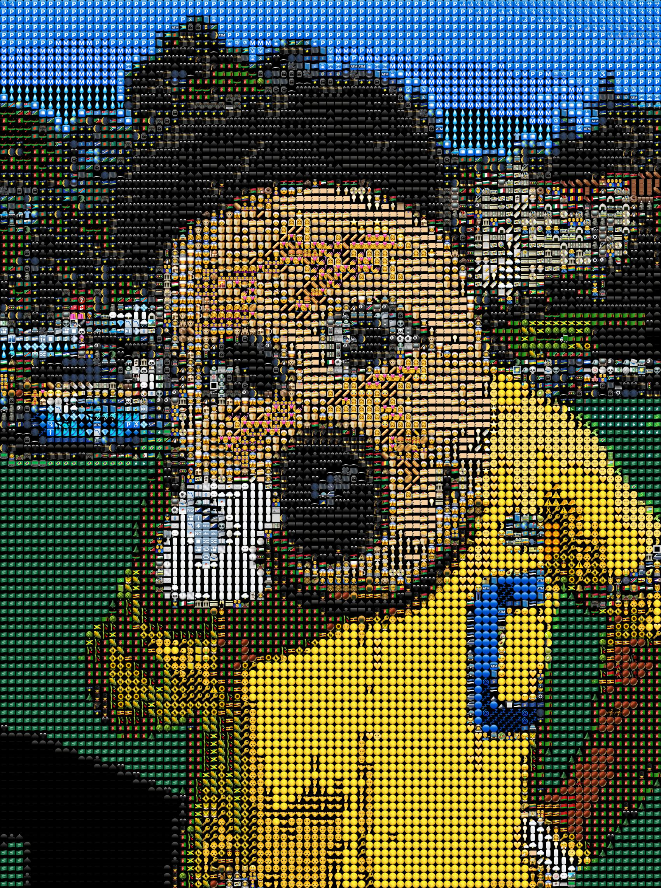

# pyEmojiVision

Heavily inspired by [emojivision](https://github.com/gabrieloc/emojivision) and [EmojiVision](https://github.com/ihollander/emoji-vision). Emojis sourced from [DumpEmoji](https://github.com/liuyuning/DumpEmoji/).

## Example
```sh
~ python3 pyEmojiVision.py img/oski.jpeg --emojiPlist emojis/Emoji_iOS10.3.1_Simulator_EmojisInCate_1432.plist
```




## How it works
1. The desired emojis are extracted from the DumpEmoji plist.
2. Each extracted emoji Unicode character is drawn to a 32x32 image.
3. The dominant color of each emoji image is found using [k-means clustering](https://en.wikipedia.org/wiki/K-means_clustering). Each dominant color is represented by a list of [RGBA](https://en.wikipedia.org/wiki/RGBA_color_model) values.
4. A [k-nearest neighbors](https://en.wikipedia.org/wiki/K-nearest_neighbors_algorithm) classifier is created and trained on the dominant emoji colors.
5. A downsized copy of the input image is created; one downsized pixel represents 20 pixels from the original image.
6. The classifier predicts the closest dominant emoji color for each downsized pixel's RGBA value.
7. The emojis corresponding to the predicted dominant emoji colors are drawn to an output image.

## Usage
Install the required Python modules before running the script.
```sh
~ pip3 install -r requirements.txt
```

```
~ python3 pyEmojiVision.py -h
usage: pyEmojiVision.py [-h] --emojiPlist EMOJIPLIST [--emojiCategory EMOJICATEGORY] input [input ...]

positional arguments:
  input                 File path(s) of the input image(s) to convert into emojis. Output image(s) will be saved to the same location as the input
                        image(s). You can pass in multiple, space-separated file paths to convert multiple images at once.

optional arguments:
  -h, --help            show this help message and exit
  --emojiPlist EMOJIPLIST
                        Path to DumpEmoji plist file that contains source emojis grouped into categories. These are the
                        `Emoji_iOS<IOS_VERSION>_Simulator_EmojisInCate_<NUM_EMOJIS>.plist` files found at
                        https://github.com/liuyuning/DumpEmoji/tree/master/Emojis
  --emojiCategory EMOJICATEGORY, --category EMOJICATEGORY
                        Category of emojis to be used for generating the output image. If not provided, the default behavior is to use emojis from all
                        categories.
```